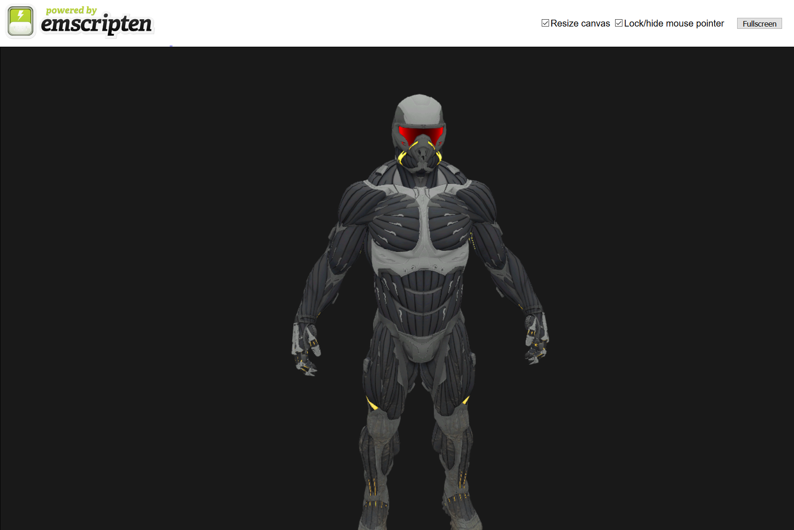

# Glitter WASM WebGL

Fair warning, this is more of a playground than an actual project. It is functional, but rough around the edges. On my list is to add a `gh-pages` live demo branch.



## Summary
[Glitter](http://polytonic.github.io/Glitter/) is a dead simple boilerplate for OpenGL, intended as a starting point for the tutorials on [learnopengl.com](http://www.learnopengl.com) and [open.gl](https://open.gl). Glitter compiles and statically links every required library, so you can jump right into doing what you probably want: how to get started with OpenGL.

## Getting Started

Please read [Getting started with WebAssembly](https://webassembly.org/getting-started/developers-guide/) before you begin. Make sure to pay special attention to the section on environment variables if you aren't on Windows.

Now, start by cloning this repository, making sure to pass the `--recursive` flag to grab all the dependencies. If you forgot, then you can `git submodule update --init` instead.

```bash
git clone --recursive https://github.com/HarryLovesCode/Glitter-WebAssembly
cd Glitter
mkdir Build
cd Build
```

We'll use `emcmake` to generate the Emscripten make files.

```bash
emcmake cmake ..
emmake make
```

You can then serve the files using `emrun`.

```bash
emrun Glitter/Glitter.html
```

## Emscripten flags

You'll see in the `CMakeLists.txt` file that we set the flags for Emscripten twice. The second time with Emscripten flags. These ones are worth explaining:

- `-s USE_WEBGL2=1` &rarr; Enables WebGL 2
- `-s WASM=1` &rarr; Forces WebAssembly output instead of `asm.js`
- `-s ALLOW_MEMORY_GROWTH=1` &rarr; Emscripten normally allocates a fixed amount of memory to run. By enabling this, you allow that buffer to grow. For example: you need to load a mesh, but don't know the size of it ahead of time.
- `--preload-file ./FOLDER/FILE` &rarr; While not used in this example, you can preload items into the virtual file system at compile time.
- `--embed-file ./FOLDER/FILE` &rarr; Again, not used in this example, but this allows you to essentially `require` files.

## Notable Differences

1. We don't include GLFW as a submodule as Emscripten has its own implementation of GLFW 3.
2. GLAD is not included per the same reason as GLFW, it's quite frankly unnecessary with Emscripten. You only need to say `#include <GLES3/gl3.h>`.

## License

>The MIT License (MIT)

>Copyright (c) 2018 Kevin Fung & Harry Gould

>Permission is hereby granted, free of charge, to any person obtaining a copy of this software and associated documentation files (the "Software"), to deal in the Software without restriction, including without limitation the rights to use, copy, modify, merge, publish, distribute, sublicense, and/or sell copies of the Software, and to permit persons to whom the Software is furnished to do so, subject to the following conditions:

>The above copyright notice and this permission notice shall be included in all copies or substantial portions of the Software.

>THE SOFTWARE IS PROVIDED "AS IS", WITHOUT WARRANTY OF ANY KIND, EXPRESS OR IMPLIED, INCLUDING BUT NOT LIMITED TO THE WARRANTIES OF MERCHANTABILITY, FITNESS FOR A PARTICULAR PURPOSE AND NONINFRINGEMENT. IN NO EVENT SHALL THE AUTHORS OR COPYRIGHT HOLDERS BE LIABLE FOR ANY CLAIM, DAMAGES OR OTHER LIABILITY, WHETHER IN AN ACTION OF CONTRACT, TORT OR OTHERWISE, ARISING FROM, OUT OF OR IN CONNECTION WITH THE SOFTWARE OR THE USE OR OTHER DEALINGS IN THE SOFTWARE.
